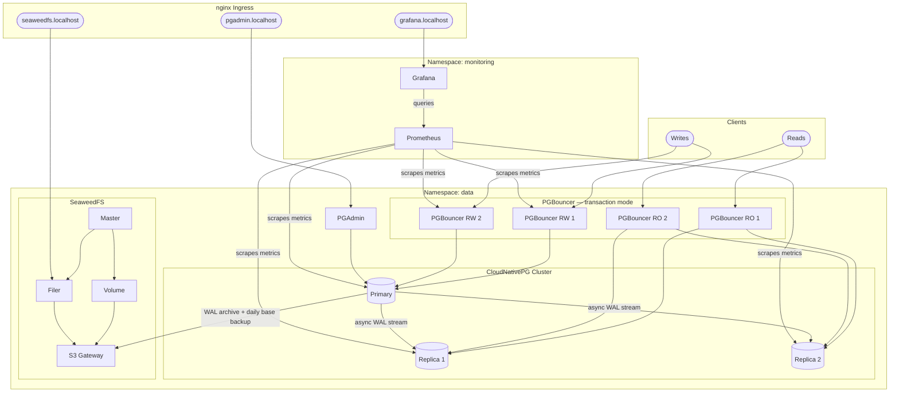

# PostgreSQL on Kubernetes (CloudNativePG + PGBouncer + SeaweedFS)

3-node PostgreSQL cluster with connection pooling via PGBouncer, continuous backups to SeaweedFS, PGAdmin for administration, and Prometheus + Grafana for monitoring — running on Kubernetes via kind.

---

## Architecture



| Component | Detail |
|---|---|
| Operator | CloudNativePG v1.28.1 |
| PostgreSQL | v18 |
| Instances | 3 (1 primary + 2 read replicas) |
| Database | `appdb`, owned by `app` user |
| Connection pooling | PGBouncer in `transaction` mode |
| Poolers | Two — RW (x2, primary) and RO (x2, replicas) |
| Storage | `standard` StorageClass, 2Gi per instance |
| Replication | Async WAL streaming to both replicas |
| Backup store | SeaweedFS (S3-compatible, runs in-cluster) |
| Backup schedule | Daily at 2am + continuous WAL archiving |
| Retention | 7 days |
| Admin UI | PGAdmin at `pgadmin.localhost` |
| Monitoring | Prometheus + Grafana at `grafana.localhost` |

---

## Files

```
postgres-k8s/
├── kind-cluster.yaml         # kind cluster (1 control-plane + 3 workers, ingress port mappings)
├── namespace.yaml            # "data" namespace
├── secret.yaml               # superuser + app user credentials
├── seaweedfs.yaml            # SeaweedFS master, volume, filer, S3 gateway
├── seaweedfs-bucket-job.yaml # one-time Job to create the backup bucket
├── objectstore.yaml          # Barman Cloud Plugin ObjectStore (backup destination)
├── cluster.yaml              # 3-node CloudNativePG cluster
├── pooler.yaml               # PGBouncer RW + RO poolers (2 instances each)
├── backup.yaml               # daily ScheduledBackup
├── pgadmin.yaml              # PGAdmin deployment + ingress
├── restore.yaml              # restore/PITR template (applied manually only)
├── kustomization.yaml        # applies all resources in order
├── monitoring/
│   └── values.yaml           # kube-prometheus-stack Helm values (minimal footprint)
└── scripts/
    └── preload-images.sh     # pulls and loads all images into kind
```

> `restore.yaml` is a **template** — not included in `kustomization.yaml`, applied manually when performing a restore.

---

## Prerequisites

- `kubectl` and `helm` configured
- `kind` and `podman` installed

### Create a kind cluster

```bash
kind create cluster --config kind-cluster.yaml
```

This creates a 4-node cluster (1 control-plane + 3 workers). The control-plane node has port mappings for the nginx ingress controller (ports 80 and 443). Each PostgreSQL replica runs on a separate worker node.

### Pre-pull images (recommended on slow connections)

Pull all required images once and load them into the kind nodes. After this, recreating the cluster requires no internet access.

```bash
# Pull from internet + load into kind (do this once on a good connection)
./scripts/preload-images.sh

# After recreating the cluster, skip the pull and just reload from local cache
./scripts/preload-images.sh --load-only
```

---

## Deployment

### 1. Install cert-manager

Required by the Barman Cloud Plugin for TLS:

```bash
kubectl apply -f https://github.com/cert-manager/cert-manager/releases/download/v1.17.1/cert-manager.yaml
kubectl rollout status deployment/cert-manager -n cert-manager
kubectl rollout status deployment/cert-manager-webhook -n cert-manager
```

### 2. Install the CloudNativePG operator

```bash
kubectl apply --server-side -f https://raw.githubusercontent.com/cloudnative-pg/cloudnative-pg/release-1.28/releases/cnpg-1.28.1.yaml
kubectl rollout status deployment/cnpg-controller-manager -n cnpg-system
```

### 3. Install the Barman Cloud Plugin

```bash
kubectl apply -f https://github.com/cloudnative-pg/plugin-barman-cloud/releases/download/v0.11.0/manifest.yaml
kubectl rollout status deployment/barman-cloud -n cnpg-system
```

### 4. Install the nginx ingress controller

```bash
helm upgrade --install ingress-nginx ingress-nginx \
  --repo https://kubernetes.github.io/ingress-nginx \
  --namespace ingress-nginx --create-namespace \
  --set controller.hostPort.enabled=true \
  --set controller.nodeSelector."ingress-ready"=true \
  --set controller.tolerations[0].key=node-role.kubernetes.io/control-plane \
  --set controller.tolerations[0].operator=Equal \
  --set controller.tolerations[0].effect=NoSchedule
kubectl rollout status deployment/ingress-nginx-controller -n ingress-nginx
```

### 5. Install kube-prometheus-stack (Helm)

```bash
helm repo add prometheus-community https://prometheus-community.github.io/helm-charts
helm repo update
kubectl create namespace monitoring
helm install kube-prometheus-stack prometheus-community/kube-prometheus-stack --namespace monitoring --version 82.10.1 --values monitoring/values.yaml
```

### 6. Update credentials

Edit `secret.yaml` and change the default passwords:

```yaml
# Superuser
stringData:
  username: postgres
  password: <your-superuser-password>

# App user
stringData:
  username: app
  password: <your-app-password>
```

Edit `seaweedfs.yaml` (`seaweedfs-s3-credentials` Secret) and ensure `accessKey`/`secretKey` inside `s3.json` match `ACCESS_KEY_ID` / `ACCESS_SECRET_KEY`.

Edit `pgadmin.yaml` and change the default PGAdmin credentials.

### 7. Apply all manifests

> **Steps 1–4 must complete before this.** `objectstore.yaml` depends on the `ObjectStore` CRD installed by the Barman Cloud Plugin in step 3.

```bash
kubectl apply -k .
```

> Podman runs rootless and cannot bind to ports below 1024. The kind cluster maps
> container port 80 → host port 8080 and 443 → 8443. Access all ingress URLs
> on port 8080 (e.g. `http://pgadmin.localhost:8080`). `*.localhost` resolves
> to `127.0.0.1` in Chrome/Firefox on all platforms (browser-level), and natively
> at the OS level on macOS. On Linux/Windows, use a browser — `curl` will need
> `/etc/hosts` entries.

### 8. Watch everything come up

```bash
# SeaweedFS
kubectl get pods -n data -l app=seaweedfs -w

# Bucket creation job (should complete quickly)
kubectl get job create-backup-bucket -n data -w

# PostgreSQL cluster
kubectl get cluster -n data -w

# Monitoring
kubectl get pods -n monitoring -w
```

The cluster is ready when `STATUS` shows `Cluster in healthy state`.

```bash
kubectl get pods -n data
```

Expected output:

```
NAME                              READY   STATUS      RESTARTS
seaweedfs-master-0                1/1     Running     0   ← cluster topology
seaweedfs-volume-0                1/1     Running     0   ← data storage
seaweedfs-filer-0                 1/1     Running     0   ← filesystem layer
seaweedfs-s3-<hash>               1/1     Running     0   ← S3 API gateway
create-backup-bucket-<hash>       0/1     Completed   0   ← removed after 5m
postgres-cluster-1                1/1     Running     0   ← primary
postgres-cluster-2                1/1     Running     0   ← replica (async)
postgres-cluster-3                1/1     Running     0   ← replica (async)
postgres-pooler-rw-<hash>         1/1     Running     0
postgres-pooler-rw-<hash>         1/1     Running     0
postgres-pooler-ro-<hash>         1/1     Running     0
postgres-pooler-ro-<hash>         1/1     Running     0
pgadmin-<hash>                    1/1     Running     0
```

### 10. Seed the initial backup

Trigger the first base backup immediately (don't wait for the 2am schedule):

```bash
kubectl apply -f - <<EOF
apiVersion: postgresql.cnpg.io/v1
kind: Backup
metadata:
  name: postgres-backup-initial
  namespace: data
spec:
  method: plugin
  pluginConfiguration:
    name: barman-cloud.cloudnative-pg.io
  cluster:
    name: postgres-cluster
EOF
```

Watch until `STATUS` shows `completed`:

```bash
kubectl get backup postgres-backup-initial -n data -w
```

---

## Connecting

### From inside the cluster

| Target | Host | Port | Database |
|---|---|---|---|
| Read + Write (via PGBouncer) | `postgres-pooler-rw.data.svc` | `5432` | `appdb` |
| Read Only (via PGBouncer) | `postgres-pooler-ro.data.svc` | `5432` | `appdb` |
| Primary (direct) | `postgres-cluster-rw.data.svc` | `5432` | `appdb` |
| Replica (direct) | `postgres-cluster-ro.data.svc` | `5432` | `appdb` |

### From your local machine

```bash
# Forward the RW pooler to localhost:5432
kubectl port-forward svc/postgres-pooler-rw 5432:5432 -n data

# Connect with psql
psql postgres://app:<password>@localhost:5432/appdb
```

### PGAdmin

Browse to [http://pgadmin.localhost:8080](http://pgadmin.localhost:8080) and add a server with:

- Host: `postgres-cluster-rw.data.svc`
- Port: `5432`
- Database: `appdb`
- Username: `app`

### Grafana

Browse to [http://grafana.localhost:8080](http://grafana.localhost:8080). CloudNativePG dashboards are pre-loaded showing replication lag, WAL activity, connection pool stats, and query performance.

### SeaweedFS UI

Browse to [http://seaweedfs.localhost:8080](http://seaweedfs.localhost:8080) to explore the SeaweedFS filer. Navigate to `/buckets/postgres-backups/` to browse WAL segments and base backup tarballs stored by Barman.

---

## Backups

### How backups work

CloudNativePG uses the **Barman Cloud Plugin** to manage backups in two layers:

1. **Continuous WAL archiving** — every WAL segment is compressed (gzip) and shipped to SeaweedFS as it is produced. This enables point-in-time recovery to any second within the retention window.
2. **Daily base backups** — a full physical snapshot runs at 2am every day. Barman automatically expires backups older than 7 days.

Both layers write to the `postgres-backups` bucket in SeaweedFS via `objectstore.yaml`.

### Check backup status

```bash
# List all backups
kubectl get backup -n data

# Describe a specific backup (shows size, WAL range, duration)
kubectl describe backup <backup-name> -n data

# Check scheduled backup status
kubectl get scheduledbackup -n data
```

### Trigger a manual backup

```bash
kubectl apply -f - <<EOF
apiVersion: postgresql.cnpg.io/v1
kind: Backup
metadata:
  name: postgres-backup-manual-$(date +%Y%m%d%H%M)
  namespace: data
spec:
  method: plugin
  pluginConfiguration:
    name: barman-cloud.cloudnative-pg.io
  cluster:
    name: postgres-cluster
EOF
```

### Browse backups in SeaweedFS

```bash
# Port-forward the SeaweedFS S3 port
kubectl port-forward svc/seaweedfs-s3 8333:8333 -n data

# List bucket contents (in another terminal)
AWS_ACCESS_KEY_ID=backup-access-key \
AWS_SECRET_ACCESS_KEY=backup-secret-key \
aws s3 ls s3://postgres-backups/ --recursive --endpoint-url http://localhost:8333
```

---

## Restore

There are two restore modes:

- **Latest restore** — recovers to the most recent consistent state
- **Point-in-time recovery (PITR)** — recovers to a specific timestamp

Both create a **new cluster** (`postgres-cluster-restored`) from the backup. The original cluster is left untouched until you are satisfied with the result.

### 1. Latest restore

```bash
kubectl apply -f restore.yaml
```

### 2. Point-in-time recovery (PITR)

Edit `restore.yaml` and uncomment the `recoveryTarget` block, setting your target time in UTC:

```yaml
bootstrap:
  recovery:
    source: postgres-cluster
    recoveryTarget:
      targetTime: "2024-01-15 02:00:00"
```

Then apply:

```bash
kubectl apply -f restore.yaml
```

### 3. Watch the restore

```bash
kubectl get cluster -n data -w
```

You will see the restored cluster transition through:
`Setting up primary` → `Joining replica` → `Cluster in healthy state`

### 4. Verify the restored data

```bash
# Port-forward the restored cluster's primary directly
kubectl port-forward svc/postgres-cluster-restored-rw 5433:5432 -n data

# Connect and inspect
psql postgres://app:<password>@localhost:5433/appdb
```

### 5. Promote the restored cluster (if replacing the original)

Once satisfied with the restored data:

```bash
# Delete the old cluster
kubectl delete cluster postgres-cluster -n data

# Update your app connection string from:
#   postgres-pooler-rw.data.svc  →  postgres-cluster-restored-rw.data.svc
```

---

## Useful commands

```bash
# Cluster health overview
kubectl get cluster -n data

# Full cluster details (events, timeline, primary election)
kubectl describe cluster postgres-cluster -n data

# PGBouncer pooler status
kubectl get pooler -n data

# Primary pod logs
kubectl logs -l cnpg.io/instanceRole=primary -n data

# Replica pod logs
kubectl logs -l cnpg.io/instanceRole=replica -n data

# Open psql shell on the primary pod directly
kubectl exec -it postgres-cluster-1 -n data -- psql -U postgres appdb

# SeaweedFS logs
kubectl logs statefulset/seaweedfs-master -n data
kubectl logs statefulset/seaweedfs-volume -n data
kubectl logs statefulset/seaweedfs-filer -n data
kubectl logs deployment/seaweedfs-s3 -n data

# Monitoring
kubectl get pods -n monitoring
```

---

## Teardown

```bash
# Remove all resources in the data namespace
kubectl delete -k .

# Remove monitoring
helm uninstall kube-prometheus-stack -n monitoring
kubectl delete namespace monitoring

# Remove the data namespace (also deletes PVCs — permanent data loss)
kubectl delete namespace data
```

To also remove the cluster-scoped components:

```bash
# Barman Cloud Plugin
kubectl delete -f https://github.com/cloudnative-pg/plugin-barman-cloud/releases/download/v0.11.0/manifest.yaml

# CloudNativePG operator
kubectl delete -f https://raw.githubusercontent.com/cloudnative-pg/cloudnative-pg/release-1.28/releases/cnpg-1.28.1.yaml

# cert-manager
kubectl delete -f https://github.com/cert-manager/cert-manager/releases/download/v1.17.1/cert-manager.yaml

# nginx ingress
kubectl delete -f https://raw.githubusercontent.com/kubernetes/ingress-nginx/main/deploy/static/provider/kind/deploy.yaml
```

---

## Production checklist

- [ ] Replace plaintext passwords in `secret.yaml`, `seaweedfs.yaml`, and `pgadmin.yaml` with a secrets manager (Sealed Secrets, Vault, AWS Secrets Manager)
- [ ] Switch `storageClass` to a cloud-provider SSD class (e.g. `gp3`, `pd-ssd`) in `cluster.yaml` and `seaweedfs.yaml`
- [ ] Increase storage `size` based on expected data volume
- [ ] Replication is async by design — if zero data loss is required, set `minSyncReplicas: 1` (safe with 3 nodes)
- [ ] Replace in-cluster SeaweedFS with a managed S3 target (AWS S3, GCS, or a production SeaweedFS cluster)
- [ ] Add resource `requests` and `limits` to all workloads
- [ ] Test your restore procedure before going live
